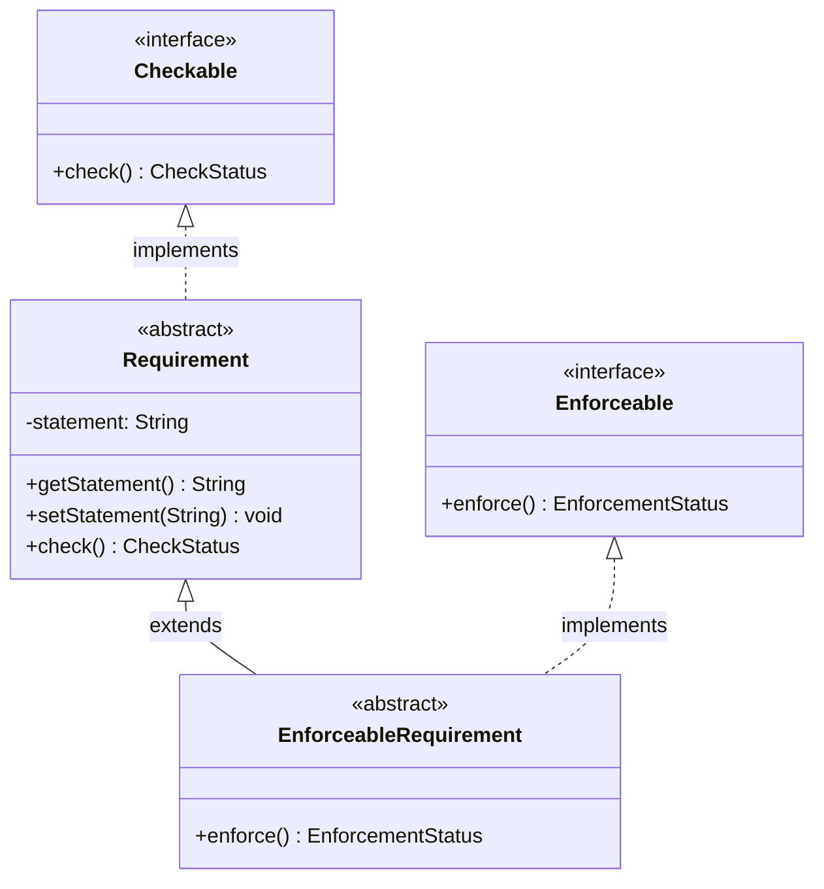

[](https://sonarcloud.io/summary/new_code?id=VeriDevOps_RQCODE)

# RQCODE - Requirements as Code

RQCODE is a novel approach for formalising security requirements based on the **Seamless Object-Oriented Requirements (SOOR)** paradigm, implemented in Java. Requirements are represented as classes that combine natural language descriptions with executable verification methods.

## Key Features

- **Verifiable Requirements**: Each requirement class incorporates a `check()` method for built-in verification
- **Enforceable Requirements**: Security requirements can include an `enforce()` method to apply countermeasures
- **Reusable**: Object-oriented inheritance and composition enable requirement reuse and extension
- **Traceable**: Direct link between requirements and their verification tests
- **Developer-Friendly**: Uses standard Java - works with existing IDEs, CI/CD pipelines, and analysis tools

## Core Concepts

RQCODE is built around two core interfaces and two abstract classes:



### CheckStatus
- `PASS` - Verification successful, requirement satisfied
- `FAIL` - Verification failed, requirement not satisfied
- `INCOMPLETE` - Verification could not be performed

### EnforcementStatus
- `SUCCESS` - Enforcement applied successfully
- `FAILURE` - Enforcement failed
- `INCOMPLETE` - Enforcement could not be performed

## Example: Basic Requirement

```java
public class TickIncrementRequirement extends Requirement {
    public TickIncrementRequirement() {
        super("A clock tick increments current second if it is smaller than 59");
    }

    @Override
    public CheckStatus check() {
        if (Clock.seconds < 59)
            return ((Clock.seconds + 1) == Clock.tick()) ?
                CheckStatus.PASS : CheckStatus.FAIL;
        return CheckStatus.INCOMPLETE;
    }
}
```

## Reuse Mechanisms

### Inheritance
Requirements can extend other requirements:

```java
public class DerivedTickBoundaryRequirement extends TickIncrementRequirement {
    public DerivedTickBoundaryRequirement() {
        super.setStatement(super.getStatement() +
            "\nIn addition, Clock seconds value must be between 0 and 59.");
    }

    @Override
    public CheckStatus check() {
        if (Clock.seconds > 59) return CheckStatus.FAIL;
        if (Clock.seconds < 0) return CheckStatus.FAIL;
        return super.check();
    }
}
```

### Composition
Multiple requirements can be combined:

```java
public class CombinedTickRequirement extends Requirement {
    TickIncrementRequirement tr;
    TickBoundaryRequirement br;

    public CombinedTickRequirement() {
        super("The Clock must satisfy tick increment and boundary requirements.");
        tr = new TickIncrementRequirement();
        br = new TickBoundaryRequirement();
    }

    @Override
    public CheckStatus check() {
        if (br.check() == CheckStatus.FAIL) return CheckStatus.FAIL;
        return tr.check();
    }
}
```

## Framework Structure

```
RQCODE Framework
├── rqcode.concepts         # Core interfaces: Checkable, Enforceable, Requirement
├── rqcode.temporal_patterns # Temporal specification patterns (LTL-based)
├── rqcode.stigs            # Security Technical Implementation Guides
│   ├── win10/           # Windows 10 STIGs (AuditPolicy, RegEdit, UserRights)
│   ├── canonical_ubuntu_18_04_lts/
│   └── unix_srg/
├── rqcode.example          # Clock example from the paper
└── rqcode.tutorial         # Password Policy Tutorial (see below)
```

## Tutorial

The **[Password Policy Tutorial](src/main/java/rqcode/tutorial/README.md)** demonstrates how to apply RQCODE to real-world security requirements. It covers:

- Password length and complexity requirements
- Account lockout after failed login attempts
- Password expiration policies
- Combining multiple requirements with `CombinedRequirements`

```bash
# Run the password policy demo
java -cp target/RQCODE-1.0.2-SNAPSHOT.jar rqcode.tutorial.MainFull
```

See the [tutorial README](src/main/java/rqcode/tutorial/README.md) for detailed documentation.

## Security Technical Implementation Guides (STIGs)

[STIGs](https://www.stigviewer.com/stigs) are security guidelines from the US Department of Defense for securing IT systems. Each STIG finding includes:
- Human-friendly explanation of the security problem
- Technical steps to identify the finding (`check()`)
- Technical steps to fix the finding (`enforce()`)

### STIG Patterns

RQCODE implements STIG patterns that enable reuse. For example, the `UbuntuPackagePattern`:

```java
public class V_219157 extends UbuntuPackagePattern {
    public V_219157() {
        super("nis", false);  // NIS package must NOT be installed
    }
}

public class V_219158 extends UbuntuPackagePattern {
    public V_219158() {
        super("rsh-server", false);  // rsh-server must NOT be installed
    }
}
```

### Windows 10 STIGs

The `win10` package contains 200+ STIG implementations organized by category:
- **AuditPolicy**: Audit policy settings (31 rules)
- **RegEdit**: Registry settings (106 rules)
- **UserRights**: User rights assignments (25 rules)

Each category has a base pattern class that handles the PowerShell script execution.

### CLI Usage

```bash
# Check a specific STIG
java -jar RQCODE.jar V_220956

# Enforce a STIG
java -jar RQCODE.jar V_220956 --enforce
```

## Temporal Patterns

RQCODE implements idiomatic temporal specification patterns for requirements that involve time-based properties:

- **GlobalUniversality**: "Globally, it is always the case that P holds"
- **GlobalUniversalityTimed**: "Globally, P holds for at least T time units"
- **GlobalResponseTimed**: "If P holds, then S holds within T time units"
- **AfterUntilUniversality**: "After Q, P holds until R holds"
- **Eventually**: "P always eventually holds"

For detailed documentation, see the [temporal patterns README](src/main/java/rqcode/temporal_patterns/README.md).

### Example: Temporal STIG Monitoring

```java
// Create a STIG requirement
V_220956 stig = new V_220956();

// Monitor it continuously for 10 time units
GlobalUniversalityTimed timedRequirement = new GlobalUniversalityTimed(stig, 10);

// Check the temporal property
CheckStatus result = timedRequirement.check();
```

## Getting Started

### Prerequisites
- Java 21 or higher
- Maven 3.x

### Build
```bash
mvn clean package
```

### Run Examples
```bash
# Run the clock example
java -cp target/RQCODE-1.0.2-SNAPSHOT.jar rqcode.example.Main
```

## Citation

If you use RQCODE in your research, please cite:

```bibtex
@incollection{sadovykh2023security,
  title={Security requirements formalization with RQCODE},
  author={Sadovykh, Andrey and Messe, Nan and Nigmatullin, Ildar and Ebersold, Sophie and Naumcheva, Maria and Bruel, Jean-Michel},
  booktitle={CyberSecurity in a DevOps Environment: From Requirements to Monitoring},
  pages={65--92},
  year={2023},
  publisher={Springer}
}
```

## Related Publications

- Ismaeel, K., Naumchev, A., Sadovykh, A., et al. "Security Requirements as Code: Example from VeriDevOps Project." IEEE RE Workshops, 2021.
- Naumchev, A., Meyer, B. "Seamless requirements." Computer Languages, Systems & Structures, 2017.

## Acknowledgments

Supported by the [VeriDevOps project](https://www.veridevops.eu/) (Horizon 2020 No. 957212).

## License

See [LICENSE](LICENSE) file.
