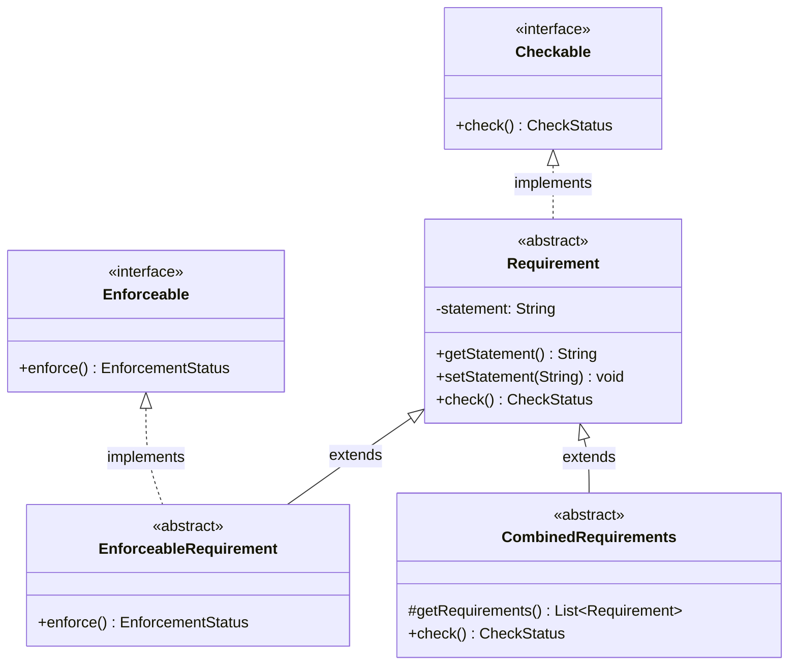

# RQCODE Core Concepts

This package contains the foundational interfaces and classes of the RQCODE framework, implementing the **Seamless Object-Oriented Requirements (SOOR)** paradigm.

## Overview

RQCODE represents security requirements as executable Java classes that combine:
- Natural language descriptions (statements)
- Verification logic (`check()` method)
- Optional enforcement logic (`enforce()` method)

## Class Hierarchy



## Interfaces

### Checkable

The `Checkable` interface defines requirements that can be verified programmatically:

```java
public interface Checkable {
    CheckStatus check();

    enum CheckStatus {
        PASS,       // Requirement is satisfied
        FAIL,       // Requirement is not satisfied
        INCOMPLETE  // Verification could not be performed
    }
}
```

### Enforceable

The `Enforceable` interface defines requirements that can apply countermeasures:

```java
public interface Enforceable {
    EnforcementStatus enforce();

    enum EnforcementStatus {
        SUCCESS,    // Enforcement applied successfully
        FAILURE,    // Enforcement failed
        INCOMPLETE  // Enforcement could not be performed
    }
}
```

## Abstract Classes

### Requirement

The base class for all RQCODE requirements. Implements `Checkable` and provides:
- A `statement` field for the natural language description
- Tracking of last check/enforcement status
- Abstract `check()` method to be implemented by subclasses

```java
public class MyRequirement extends Requirement {
    public MyRequirement() {
        super("The system must satisfy condition X");
    }

    @Override
    public CheckStatus check() {
        // Verification logic
        return condition ? CheckStatus.PASS : CheckStatus.FAIL;
    }
}
```

### EnforceableRequirement

Extends `Requirement` and implements `Enforceable` for requirements that can both verify and apply fixes:

```java
public class MyEnforceableRequirement extends EnforceableRequirement {
    public MyEnforceableRequirement() {
        super("The system must have setting X enabled");
    }

    @Override
    public CheckStatus check() {
        // Check if setting X is enabled
    }

    @Override
    public EnforcementStatus enforce() {
        // Enable setting X
    }
}
```

### CombinedRequirements

An abstract class for composing multiple requirements. Implements a default `check()` that verifies all sub-requirements:

```java
public class MyCombinedRequirement extends CombinedRequirements {
    private Requirement req1 = new Requirement1();
    private Requirement req2 = new Requirement2();

    @Override
    protected List<Requirement> getRequirements() {
        return List.of(req1, req2);
    }
}
```

The combined check returns:
- `PASS` only if all requirements pass
- The first non-passing status otherwise

## Design Principles

### Seamless Requirements

Requirements are "seamless" because they bridge the gap between:
- **Specification**: Natural language statement describing what must hold
- **Verification**: Executable code that checks the requirement
- **Enforcement**: Optional code that fixes violations

### Reuse Mechanisms

RQCODE supports two reuse mechanisms:

1. **Inheritance**: Extend existing requirements to add constraints
2. **Composition**: Combine multiple requirements into one (via `CombinedRequirements`)

## References

- Sadovykh, A., et al. "Security requirements formalization with RQCODE." CyberSecurity in a DevOps Environment, Springer, 2023.
- Naumchev, A., Meyer, B. "Seamless requirements." Computer Languages, Systems & Structures, 2017.
