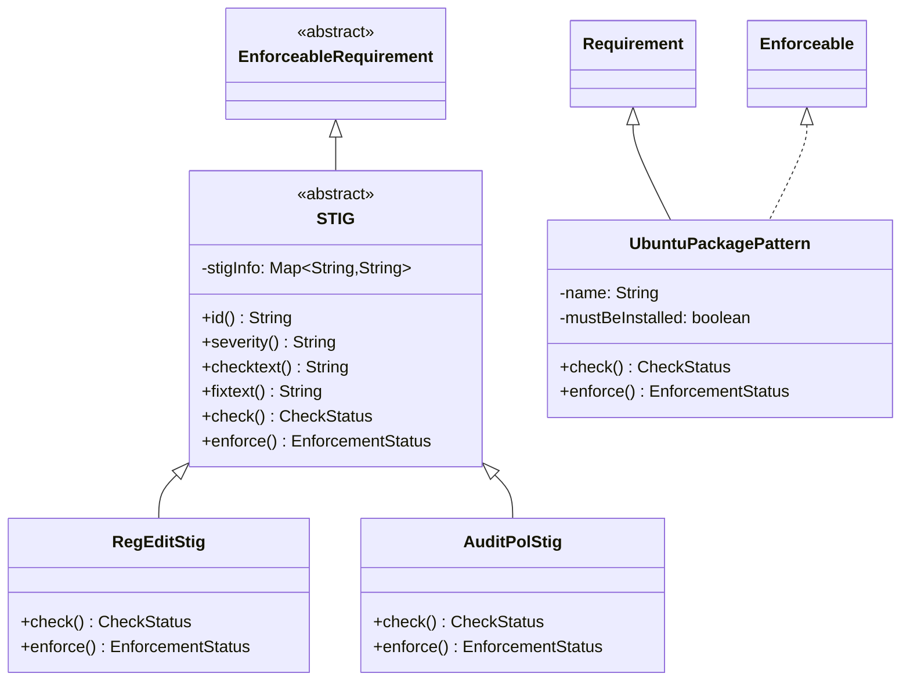

# RQCODE STIGs Implementation

This package implements [Security Technical Implementation Guides (STIGs)](https://public.cyber.mil/stigs/) as executable RQCODE requirements.

## What are STIGs?

STIGs are security configuration standards developed by the Defense Information Systems Agency (DISA) for the U.S. Department of Defense. Each STIG provides:

- **Human-friendly explanation** of the security problem
- **Check procedure** - steps to identify if the finding exists
- **Fix procedure** - steps to remediate the finding

RQCODE maps these directly to Java classes with `check()` and `enforce()` methods.

## Architecture



## STIG Base Class

The `STIG` abstract class extends `EnforceableRequirement` and provides:

- Storage for STIG metadata (ID, severity, description, check text, fix text)
- Formatted output via `toString()`
- CLI integration via `cli()` method

```java
public abstract class STIG extends EnforceableRequirement {
    private Map<String, String> stigInfo;

    public String id();        // e.g., "V-220956"
    public String severity();  // e.g., "high", "medium", "low"
    public String checktext(); // Verification procedure
    public String fixtext();   // Remediation procedure
}
```

## Implemented STIG Collections

### Windows 10 (`win10/`)

200+ STIG rules organized by category:

| Category | Pattern Class | Count | Description |
|----------|--------------|-------|-------------|
| **AuditPolicy** | `AuditPolStig` | 31 | Windows audit policy settings |
| **RegEdit** | `RegEditStig` | 106 | Windows registry configurations |
| **UserRights** | `UserRightsStig*` | 25 | User rights assignments |

Each category uses PowerShell scripts for verification and enforcement.

### Ubuntu 18.04 LTS (`canonical_ubuntu_18_04_lts/`)

Linux STIG implementations using shell scripts:

| Pattern | Description |
|---------|-------------|
| `UbuntuPackagePattern` | Verifies package installation status |
| `UbuntuScriptPattern` | Executes custom verification scripts |

### Unix SRG (`unix_srg/`)

Generic Unix Security Requirements Guide implementations.

## Pattern-Based Design

RQCODE uses patterns to maximize reuse. For example, many Ubuntu STIGs just verify package presence:

```java
// V_219157: NIS package must NOT be installed
public class V_219157 extends UbuntuPackagePattern {
    public V_219157() {
        super("nis", false);  // package name, must NOT be installed
    }
}

// V_219158: rsh-server must NOT be installed
public class V_219158 extends UbuntuPackagePattern {
    public V_219158() {
        super("rsh-server", false);
    }
}
```

Windows registry STIGs follow a similar pattern:

```java
public class V_220727 extends RegEditStig {
    public V_220727() {
        // Configure registry path, attribute, and expected value
        getHelper().setCheckValues(Map.of(
            "path", "HKLM:\\SOFTWARE\\...",
            "attr", "EnableScriptBlockLogging",
            "result_value", "1"
        ));
    }
}
```

## CLI Usage

The `Cli` class provides command-line access to any STIG:

```bash
# Show help
java -jar RQCODE.jar --help

# Check a specific STIG
java -jar RQCODE.jar V_220956

# Enforce a STIG (requires admin rights)
java -jar RQCODE.jar V_220956 --enforce
```

Exit codes:
- `0` - PASS/SUCCESS
- `1` - FAIL/FAILURE
- `-1` - INCOMPLETE

## Integration with Temporal Patterns

STIGs can be combined with temporal patterns for continuous monitoring:

```java
// Create STIG requirement
V_220956 stig = new V_220956();

// Monitor continuously for compliance
GlobalUniversalityTimed monitor = new GlobalUniversalityTimed(stig, Integer.MAX_VALUE);

// Start monitoring
CheckStatus result = monitor.check();
```

## Adding New STIGs

1. **Choose the appropriate pattern** (or create a new one)
2. **Extend the pattern class**
3. **Configure parameters** in the constructor
4. **STIG metadata** is automatically populated from the pattern

See existing implementations for examples.

## References

- [STIG Viewer](https://www.stigviewer.com/stigs) - Browse STIG rules
- [DISA STIGs](https://public.cyber.mil/stigs/) - Official STIG downloads
- Sadovykh, A., et al. "Security requirements formalization with RQCODE." CyberSecurity in a DevOps Environment, Springer, 2023.
