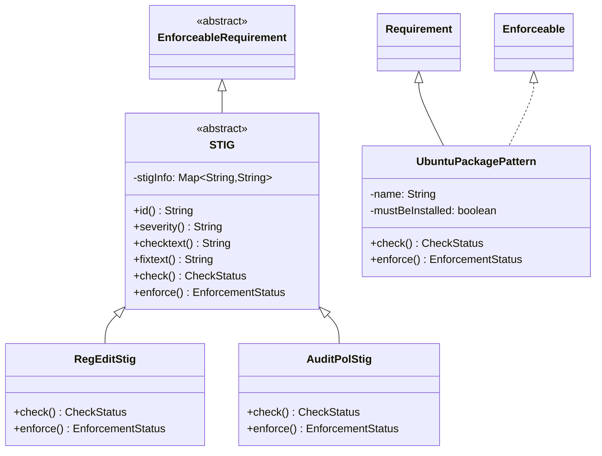

# RQCODE STIGs Implementation

This package implements [Security Technical Implementation Guides (STIGs)](https://public.cyber.mil/stigs/) as executable RQCODE requirements.

## What are STIGs?

STIGs are security configuration standards developed by the Defense Information Systems Agency (DISA) for the U.S. Department of Defense. Each STIG provides:

- **Human-friendly explanation** of the security problem
- **Check procedure** - steps to identify if the finding exists
- **Fix procedure** - steps to remediate the finding

RQCODE maps these directly to Java classes with `check()` and `enforce()` methods.

## Architecture


```mermaid
classDiagram
    class EnforceableRequirement {
        <<abstract>>
    }
    class STIG {
        <<abstract>>
        -stigInfo: Map~String,String~
        +id() String
        +severity() String
        +checktext() String
        +fixtext() String
        +check() CheckStatus
        +enforce() EnforcementStatus
    }
    class RegEditStig {
        +check() CheckStatus
        +enforce() EnforcementStatus
    }
    class AuditPolStig {
        +check() CheckStatus
        +enforce() EnforcementStatus
    }
    class UbuntuPackagePattern {
        -name: String
        -mustBeInstalled: boolean
        +check() CheckStatus
        +enforce() EnforcementStatus
    }

    EnforceableRequirement <|-- STIG
    STIG <|-- RegEditStig
    STIG <|-- AuditPolStig
    Requirement <|-- UbuntuPackagePattern
    Enforceable <|.. UbuntuPackagePattern
```

## STIG Base Class

The `STIG` abstract class extends `EnforceableRequirement` and provides:

- Storage for STIG metadata (ID, severity, description, check text, fix text)
- Formatted output via `toString()`
- CLI integration via `cli()` method

```java
public abstract class STIG extends EnforceableRequirement {
    private Map<String, String> stigInfo;

    public String id();        // e.g., "V-220956"
    public String severity();  // e.g., "high", "medium", "low"
    public String checktext(); // Verification procedure
    public String fixtext();   // Remediation procedure
}
```

## Implemented STIG Collections

### Windows 10 (`win10/`)

190/257 findings (74%) of the DISA Windows 10 STIG (V2R2, 2021-08-18), organized by category:

| Category | Pattern Class | Count | Description |
|----------|--------------|-------|-------------|
| **AuditPolicy** | `AuditPolStig` | 38 | Windows audit policy settings |
| **RegEdit** | `RegEditStig`, `MultiPathRegEditStig` | 124 | Windows registry configurations |
| **UserRights** | `UserRightsStig*` | 28 | User rights assignments |

Each category uses PowerShell scripts for verification and enforcement.
`MultiPathRegEditStig` extends the RegEdit pattern to findings that require
several `{path, attribute, value}` triples to hold jointly (e.g. the same
value mirrored across multiple registry paths, or several values under one
key) before the finding is considered satisfied.

The remaining 67 findings need verification mechanisms this package does not
yet implement (local security policy via `secedit`, certificate store
inspection, ACL/permission checks, optional-feature/service presence,
hardware/firmware state such as TPM, UEFI, Secure Boot or BitLocker), or are
not meaningfully machine-checkable at all (e.g. "camera must be physically
covered when not in use", "Bluetooth use must be approved by the
organization"). Several of the newly added findings also encode a
deliberate simplification where the source STIG accepts a *range or set* of
compliant values but this pattern checks equality against one representative
value -- see the per-class Javadoc notes.

### Ubuntu 18.04 LTS (`canonical_ubuntu_18_04_lts/`)

Linux STIG implementations using shell scripts:

| Pattern | Description |
|---------|-------------|
| `UbuntuPackagePattern` | Verifies package installation status |
| `UbuntuScriptPattern` | Executes custom verification scripts |

### Unix SRG (`unix_srg/`)

Generic Unix Security Requirements Guide implementations.

## Pattern-Based Design

RQCODE uses patterns to maximize reuse. For example, many Ubuntu STIGs just verify package presence:

```java
// V_219157: NIS package must NOT be installed
public class V_219157 extends UbuntuPackagePattern {
    public V_219157() {
        super("nis", false);  // package name, must NOT be installed
    }
}

// V_219158: rsh-server must NOT be installed
public class V_219158 extends UbuntuPackagePattern {
    public V_219158() {
        super("rsh-server", false);
    }
}
```

Windows registry STIGs follow a similar pattern:

```java
public class V_220727 extends RegEditStig {
    public V_220727() {
        // Configure registry path, attribute, and expected value
        getHelper().setCheckValues(Map.of(
            "path", "HKLM:\\SOFTWARE\\...",
            "attr", "EnableScriptBlockLogging",
            "result_value", "1"
        ));
    }
}
```

## CLI Usage

The `Cli` class provides command-line access to any STIG:

```bash
# Show help
java -jar RQCODE.jar --help

# Check a specific STIG
java -jar RQCODE.jar V_220956

# Enforce a STIG (requires admin rights)
java -jar RQCODE.jar V_220956 --enforce
```

Exit codes:
- `0` - PASS/SUCCESS
- `1` - FAIL/FAILURE
- `-1` - INCOMPLETE

## Integration with Temporal Patterns

STIGs can be combined with temporal patterns for continuous monitoring:

```java
// Create STIG requirement
V_220956 stig = new V_220956();

// Monitor continuously for compliance
GlobalUniversalityTimed monitor = new GlobalUniversalityTimed(stig, Integer.MAX_VALUE);

// Start monitoring
CheckStatus result = monitor.check();
```

## Adding New STIGs

1. **Choose the appropriate pattern** (or create a new one)
2. **Extend the pattern class**
3. **Configure parameters** in the constructor
4. **STIG metadata** is automatically populated from the pattern

See existing implementations for examples.

## References

- [STIG Viewer](https://www.stigviewer.com/stigs) - Browse STIG rules
- [DISA STIGs](https://public.cyber.mil/stigs/) - Official STIG downloads
- Sadovykh, A., et al. "Security requirements formalization with RQCODE." CyberSecurity in a DevOps Environment, Springer, 2023.
