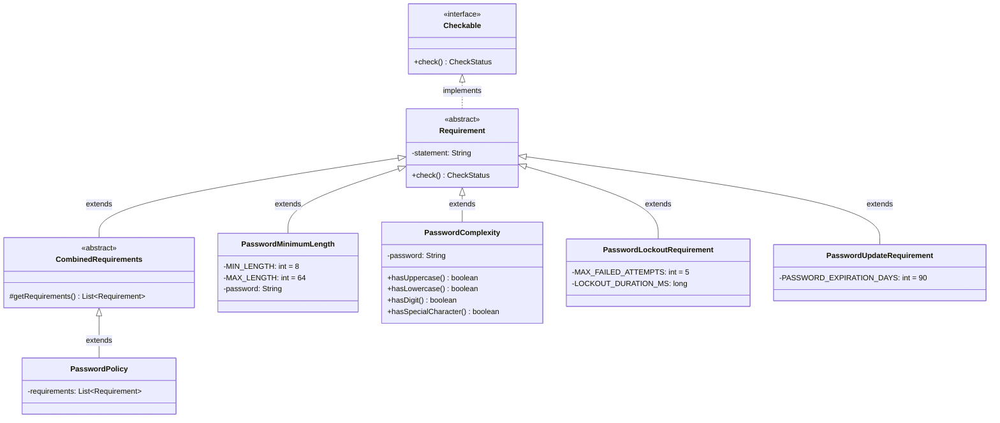

# RQCODE Tutorial - Password Policy Requirements

This tutorial demonstrates how to apply RQCODE to structure security requirements in an object-oriented way and translate them into executable code.

## Introduction

RQCODE provides a structured framework for defining, verifying, and enforcing security requirements. This tutorial uses a **Password Policy** example to demonstrate the key concepts.

### Value of Processing Security Requirements with RQCODE

- **Consistency**: Uniform enforcement of security requirements throughout the application
- **Systematic Verification**: Structured approach to verify and analyze security requirements
- **Reusability**: Security requirement templates can be reused across different applications
- **Maintenance**: Modular approach makes updates and modifications easier to manage

## Prerequisites

1. **Java Development Kit (JDK)**: Version 8 or higher ([Download](https://www.oracle.com/java/technologies/javase-downloads.html))
2. **IDE**: IntelliJ IDEA recommended ([Download](https://www.jetbrains.com/idea/download/))
3. **Clone the project**:
   ```bash
   git clone https://github.com/VeriDevOps/RQCODE.git
   ```
4. **Build**: Import as Maven project in your IDE

## Class Hierarchy



## Password Policy Requirements

### Requirement 1: Minimum Length (`PasswordMinimumLength`)

Passwords must meet length constraints:

| Check | Description |
|-------|-------------|
| 1.1 | Passwords must be at least 8 characters long |
| 1.2 | Passwords must be no more than 64 characters long |
| 1.3 | Passwords should not be empty |

```java
public class PasswordMinimumLength extends Requirement {
    private static final int MIN_LENGTH = 8;
    private static final int MAX_LENGTH = 64;
    private String password;

    public PasswordMinimumLength(String password) {
        super("Requirement 1: Password Length Requirements");
        this.password = password;
    }

    @Override
    public CheckStatus check() {
        // Verification logic
    }
}
```

### Requirement 2: Complexity Requirements (`PasswordComplexity`)

Passwords must include character variety:

| Check | Description |
|-------|-------------|
| 2.1.1 | One uppercase letter (A-Z) |
| 2.1.2 | One lowercase letter (a-z) |
| 2.1.3 | One digit (0-9) |
| 2.1.4 | One special character (!@#$%^&*) |

```java
public class PasswordComplexity extends Requirement {
    private String password;

    private boolean hasUppercase() {
        return password.chars().anyMatch(Character::isUpperCase);
    }

    private boolean hasLowercase() {
        return password.chars().anyMatch(Character::isLowerCase);
    }

    private boolean hasDigit() {
        return password.chars().anyMatch(Character::isDigit);
    }

    private boolean hasSpecialCharacter() {
        return password.chars().anyMatch(ch -> "!@#$%^&*".indexOf(ch) >= 0);
    }

    @Override
    public CheckStatus check() {
        // Returns PASS only if all checks pass
    }
}
```

### Requirement 3: Account Lockout (`PasswordLockoutRequirement`)

Prevents brute-force attacks:

- Maximum 5 consecutive failed login attempts
- 15-minute lockout duration after threshold reached

### Requirement 4: Password Expiration (`PasswordUpdateRequirement`)

Ensures regular password rotation:

- Passwords must be updated every 90 days

## Verification Status Explanation

The `check()` method returns one of three statuses:

| Status | Description |
|--------|-------------|
| `PASS` | All requirements are satisfied |
| `FAIL` | One or more requirements are not met |
| `INCOMPLETE` | Verification cannot be executed (e.g., null password) |

## Combining Requirements with `PasswordPolicy`

The `PasswordPolicy` class extends `CombinedRequirements` to aggregate multiple requirements:

```java
public class PasswordPolicy extends CombinedRequirements {
    private final List<Requirement> requirements;

    public PasswordPolicy(Requirement... requirements) {
        this.requirements = Arrays.asList(requirements);
    }

    @Override
    protected List<Requirement> getRequirements() {
        return requirements;
    }
}
```

The combined `check()` method:
- Returns `PASS` only if **all** requirements pass
- Returns the first non-passing status otherwise

## Running the Tutorial

### Password Policy Demo (`MainFull`)

Demonstrates password validation with length and complexity checks:

```bash
java -cp target/RQCODE-1.0.2-SNAPSHOT.jar rqcode.tutorial.MainFull
```

**Example output (PASS):**
```
Enter Password: P@ssword123!
Requirement 1: Minimum Length
1.1: Passwords must be at least 8 characters long - PASS
1.2: Passwords must be no more than 64 characters long - PASS
1.3: Passwords should not be empty - PASS
Requirement 2: Complexity Requirements
2.1.1: One uppercase letter (A-Z) - PASS
2.1.2: One lowercase letter (a-z) - PASS
2.1.3: One digit (0-9) - PASS
2.1.4: One special character (!@#$%^&*) - PASS
Final Status: PASS
```

**Example output (FAIL):**
```
Enter Password: password
Requirement 1: Minimum Length
1.1: Passwords must be at least 8 characters long - PASS
1.2: Passwords must be no more than 64 characters long - PASS
1.3: Passwords should not be empty - PASS
Requirement 2: Complexity Requirements
2.1.1: One uppercase letter (A-Z) - FAIL
2.1.2: One lowercase letter (a-z) - PASS
2.1.3: One digit (0-9) - FAIL
2.1.4: One special character (!@#$%^&*) - FAIL
Final Status: FAIL
```

### Account Lockout Demo (`Main`)

Demonstrates the account lockout mechanism:

```bash
java -cp target/RQCODE-1.0.2-SNAPSHOT.jar rqcode.tutorial.Main
```

Interactive menu to:
1. Simulate failed login attempts
2. Reset failed attempts
3. Check lockout status

## Classes Summary

| Class | Description |
|-------|-------------|
| `MainFull` | Entry point for password policy verification demo |
| `Main` | Entry point for account lockout demo |
| `PasswordMinimumLength` | Verifies password length (8-64 characters) |
| `PasswordComplexity` | Verifies character complexity requirements |
| `PasswordPolicy` | Combines multiple requirements into one check |
| `PasswordLockoutRequirement` | Implements account lockout after failed attempts |
| `PasswordUpdateRequirement` | Verifies password is updated within 90 days |
| `PasswordStorage` | Helper class for storing password timestamps |

## References

- [RQCODE Core Concepts](../concepts/README.md)
- [Requirement Class](../concepts/Requirement.java)
- [CombinedRequirements Class](../concepts/CombinedRequirements.java)
